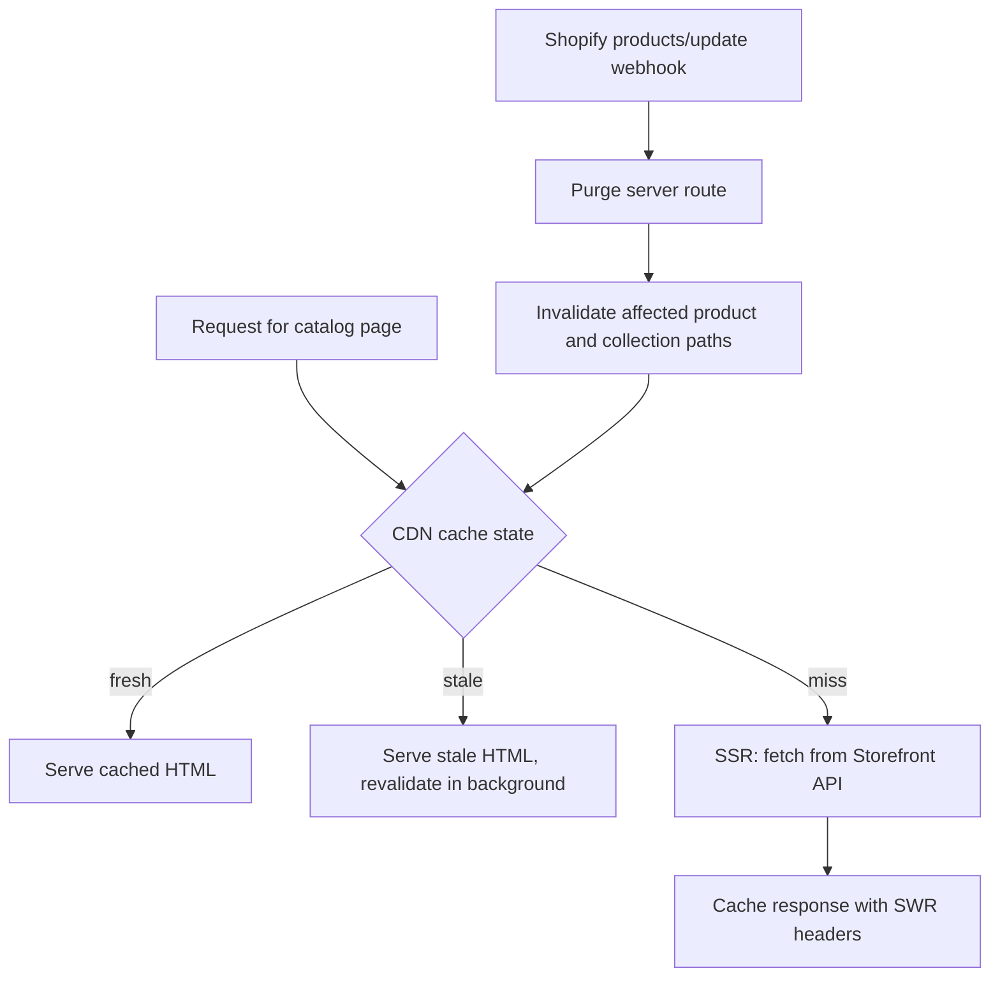
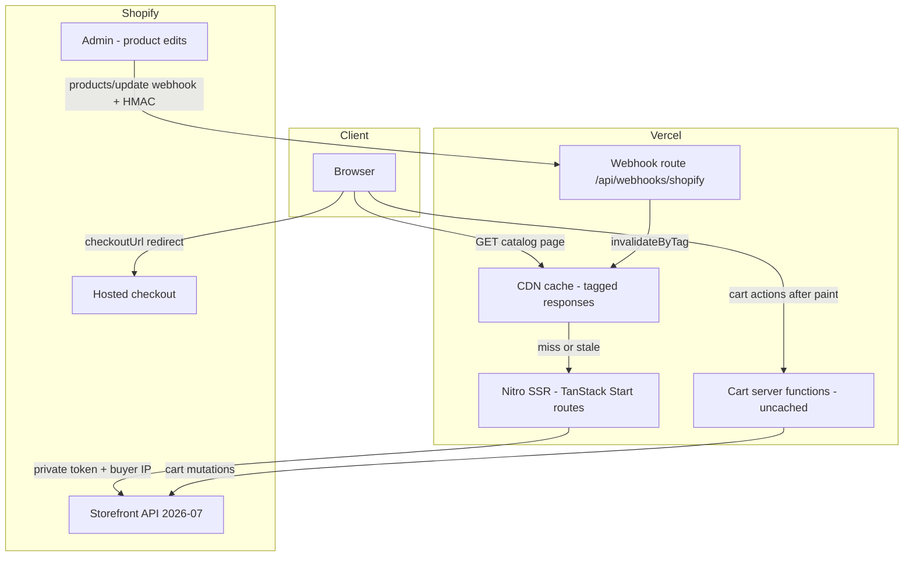

# Jewelry Aura Headless Shopify Storefront - Plan

## Goal Capsule

- **Objective:** Turn the Jewelry Aura site into an SEO-first headless Shopify storefront — visitors land right on the shop (GLD/JAXXON model) — built in this repo on the existing TanStack Start + Vercel stack, Shopify Storefront API for commerce, Shopify-hosted checkout, starting with a working SSR'd product list.
- **Product authority:** Sameer (owner). This document's Product Contract is authoritative for scope; the owner supplies store credentials and content picks (featured collections).
- **Execution profile:** Incremental with one hard checkpoint — pause after U2 (SSR'd product list from the real dev store) for owner review before any page work.
- **Stop conditions:** Stop and surface rather than guess when: store credentials are unavailable at U2 start; live-schema validation contradicts a planned query shape; or the production build gate fails in a way that implicates the nitro-nightly dependency rather than plan code.
- **Open blockers:** None for starting U1. Store domain + Headless channel tokens (public + private) are required at U2 and stay with the owner until then.

---

## Product Contract

### Summary

The storefront is built into this repo — the existing Jewelry Aura TanStack Start site — so visitors land right on the shop at the apex domain, in the mold of GLD and JAXXON. It adds four MVP surfaces — a commerce-first homepage with featured collections, collection pages, product detail pages, and a cart drawer — fully server-rendered, cached at the CDN with stale-while-revalidate, and purged on Shopify product updates. Checkout hands off to Shopify.

### Problem Frame

Jewelry Aura is a jewelry boutique in Norridge, IL. Its site (this repo) presents the brand and routes commission inquiries to a visit page, but nothing on the domain can sell inventory directly. A Shopify theme storefront would sacrifice the brand's editorial design control. The reference points are GLD and JAXXON — jewelry brands whose sites land visitors directly on a shoppable storefront with the brand story woven around it.

### Key Decisions

- **One repo, one site.** The storefront is built into this repo and deploys through the existing Vercel project on the apex domain. The homepage becomes the shop landing (GLD/JAXXON model); the existing brand sections and the Visit/commission flow remain part of the site. Brand tokens in `src/app.css` are used directly — no porting or syncing.
- **Current TanStack Start setup only.** `vite.config.ts` with the `tanstackStart()` and `nitro()` plugins, route `head` API for metadata, `createServerFn` / server routes for server logic. No Vinxi, no `app.config.ts`. The scaffold is verified against current TanStack Start docs at build time, not written from memory.
- **SSR + CDN stale-while-revalidate + webhook purge as the ISR replacement.** Catalog pages render on the server, cache at the CDN with SWR headers, and are purged on-demand when Shopify signals a product update. Selective SSR lets purely interactive pieces opt out without making crawlable pages client-only.
- **Shopify-hosted checkout.** Cart is managed via the Storefront Cart API; the buyer is redirected to `cart.checkoutUrl`. No custom checkout is built.
- **Storefront API access is server-side only.** API version pinned to 2026-07 via `@shopify/storefront-api-client`. The private Headless-channel token lives in server env only and never reaches the browser. Every query and mutation is validated against the live Storefront schema before it is finalized.
- **Forest/champagne palette only.** `src/app.css` carries a legacy obsidian/gold palette alongside the current brand palette; new storefront UI uses only the forest-green/champagne/cream system, the Fraunces/Playfair/Manrope type stack, and the motion tokens.
- **Crawlable numbered pagination on collections.** Link-based pages, not infinite scroll, so collection depth is indexable.
- **Incremental delivery.** Scaffold + Storefront client + one SSR'd product list from the real dev store is the first checkpoint; pages follow one at a time after the owner reviews it.

### Requirements

**Platform and deployment**

- R1. The storefront is built in this repo as new routes and modules on the existing TanStack Start stack — Vite + Nitro plugins, React 19, TypeScript, Tailwind CSS 4.
- R2. The site continues to deploy through the existing Vercel project (Nitro Vercel preset) on the apex domain; landing on the homepage means landing on the storefront.
- R3. Store domain and Storefront tokens are read from environment variables; the private token is never bundled into client code. In Vercel, `SHOPIFY_STOREFRONT_PRIVATE_TOKEN` and `SHOPIFY_WEBHOOK_SECRET` are scoped to the Production environment only, and a rotation runbook documents replacing each secret.

**Commerce integration**

- R4. All Storefront API calls run server-side through `createServerFn` or server routes using `@shopify/storefront-api-client` pinned to API version 2026-07.
- R5. Every GraphQL query and mutation is validated against the live Storefront schema before being finalized — concretely, via GraphQL codegen with `@shopify/api-codegen-preset` introspecting the live 2026-07 Storefront schema (installed in U1; exact command in the Verification Contract).
- R6. Cart operations use the Cart API exclusively — `cartCreate`, `cartLinesAdd`, `cartLinesUpdate`, `cartLinesRemove`. The deprecated Checkout API is not used anywhere.
- R7. Checkout redirects the buyer to `cart.checkoutUrl`; no custom checkout UI exists.
- R8. The cart id persists in a cookie and the cart rehydrates from it on page load.

**MVP pages**

- R9. The homepage is the shop landing — commerce-first with featured collections, retaining the brand's editorial character and the Visit/commission flow.
- R10. Collection page listing products with crawlable numbered pagination.
- R11. Product detail page with variant selection, product images, and add-to-cart.
- R12. Cart drawer showing line items with quantity update and removal.

**Rendering and caching**

- R13. Product and collection routes are fully SSR'd; selective SSR may exempt purely interactive components, never crawlable content.
- R14. Page HTML is cached at the CDN with stale-while-revalidate Cache-Control headers.
- R15. Loader/query staleTime stays low enough that price and inventory refresh in the background rather than serving indefinitely stale data.
- R16. A server route receives the Shopify `products/update` and `products/delete` webhooks and purges the affected product's cache tags (`product-{handle}`, `products`, `home`). Collection-page freshness is timer-bounded by the SWR window (KTD2), not webhook-purged.

**SEO**

- R17. Every route sets title, meta description, canonical URL, and Open Graph tags via the route `head` API.
- R18. JSON-LD is emitted: Product on PDPs, BreadcrumbList on catalog pages, Organization site-wide.
- R19. A server route generates an XML sitemap covering all product and collection URLs; robots.txt is served.
- R20. Canonical URLs use the site's production origin (the existing `SITE_URL` constant), one canonical per catalog URL.
- R21. Images load from the Shopify CDN with explicit sizing and srcset; below-the-fold images lazy-load. LCP on catalog pages meets the Core Web Vitals "good" threshold (≤ 2.5s).

**Design**

- R22. Storefront UI uses the in-repo Jewelry Aura brand system from `src/app.css`: forest/champagne palette, editorial serif + clean sans type pairing, and motion tokens.
- R23. Copy carries the brand's confident streetwear-luxury voice.

### Key Flows

- F1. Browse to purchase
  - **Trigger:** Shopper lands on any catalog page.
  - **Steps:** Landing or collection → PDP → select variant → add to cart (server-side mutation) → cart drawer opens with line items → shopper proceeds → redirect to `cart.checkoutUrl` → Shopify completes payment.
  - **Covers:** R6, R7, R9–R12.
- F2. Content update propagation
  - **Trigger:** Merchant edits a product in Shopify admin.
  - **Steps:** Shopify sends `products/update` (or `products/delete`) webhook → server route authenticates it → the product's tags (`product-{handle}`, `products`, `home`) are purged → next request re-renders fresh from the Storefront API and re-caches. Collection pages refresh on their SWR timer instead (KTD2); webhook purge is best-effort, the SWR window is the backstop.
  - **Covers:** R14–R16.
- F3. Cart persistence
  - **Trigger:** Shopper returns to the site with a cart cookie set.
  - **Steps:** Cookie read on load → cart fetched by id → drawer and badge reflect existing lines.
  - **Covers:** R8.



### Acceptance Examples

- AE1. **Covers R8.** Given a shopper who added items yesterday, when they return, then the cart drawer shows their existing line items without any action.
- AE2. **Covers R6, R8.** Given a cart cookie whose cart was already completed at checkout or has expired, when the shopper next adds an item, then a new cart is created transparently and no error surfaces.
- AE3. **Covers R14–R16.** Given a price change in Shopify admin, when the webhook purge succeeds, then the next request serves the new price; if purge is unavailable, the SWR window bounds how long the old price can appear.
- AE4. **Covers R13, R17, R18.** Given a crawler fetching a PDP with JavaScript disabled, when the response arrives, then it contains the full product content, metadata, and Product JSON-LD in the HTML.

### Success Criteria

- Checkpoint 1 (gates all further pages): the storefront renders a product list from the real dev store, with product data present in the server-rendered HTML (verifiable via view-source or curl).
- Every catalog URL returns complete content server-side; sitemap enumerates all products and collections; JSON-LD validates.
- The storefront reads as the same Jewelry Aura brand as the existing site — same palette, type, and motion character.

### Scope Boundaries

**Deferred for later**

- Search and product filtering beyond collection pagination.
- Customer accounts, order history, wishlists.
- Analytics and tracking instrumentation.
- Editorial/content pages beyond the reworked homepage (the existing sections own storytelling).
- Multi-currency, markets, localization.

**Outside this product's identity**

- Custom checkout. Payment, shipping, and tax stay Shopify-hosted permanently — this is a positioning decision, not a deferral.
- A separate shop subdomain or split deployment — the site is one app on one domain.

### Dependencies / Assumptions

- A Partner dev store with the Headless channel exists; the owner supplies the store domain, public token, and private token when integration begins.
- Webhook registration requires a small custom app in the store admin — the Headless channel alone does not emit webhooks.
- The store transfers to the client at launch; the myshopify domain and Headless tokens are assumed to survive the transfer — verify near launch. Runbook item: after the transfer AND after any domain change, re-verify the custom app's API secret and re-run `webhookSubscriptionCreate` against the final absolute callback URL (KTD9).
- Brand tokens, motion system, and SEO helpers already exist in-repo (`src/app.css`, `src/lib/motion.ts`, `src/lib/seo.ts`) and are reused directly.
- The production origin is the existing `SITE_URL` (`jewelry-aura.com`); if the live domain changes, it is a config-level update per `SEO_NOTES.md`.

### Outstanding Questions

**Resolve during implementation with the owner**

- Store domain and Storefront tokens (owner provides at U2 start; deferred, non-blocking for planning).
- Which collections are "featured" on the homepage (content decision at U7; a config constant carries placeholders until then).

### Sources / Research

- `src/app.css` — `@theme` token block: brand palette, type stack, motion durations/easings; the legacy obsidian/gold palette in the same file is marked legacy and stays out of new storefront UI.
- `src/lib/seo.ts` and `SEO_NOTES.md` — existing SEO constants, JSON-LD schemas (JewelryStore, Organization), and notes to extend for the storefront's metadata layer.
- `src/routes/__root.tsx` — the working route `head` pattern: Google Fonts with preconnect + display-face preload, hero image preloads, canonical link.
- TanStack Start docs (tanstack.com/start/latest): server routes via `createFileRoute(...).server.handlers` (older `createAPIFileRoute`/`createServerFileRoute` are deprecated); route `headers()` for response headers; `head.scripts` for JSON-LD; loader `staleTime`/`gcTime`; cookies via `@tanstack/react-start/server`.
- Shopify docs (shopify.dev): 2026-07 is current stable; Checkout API removed April 2025; `product(handle:)`/`collection(handle:)` replace deprecated byHandle queries; image srcset via `url(transform:)` aliases; `seo { title description }` fields; webhook HMAC via `X-Shopify-Hmac-Sha256` over the raw body; `products/update` payload includes `handle` but not collection membership; automated-collection membership changes fire no webhook.
- Vercel docs (vercel.com/docs/caching): cache tags via `Vercel-Cache-Tag` header + `invalidateByTag` from `@vercel/functions` are framework-agnostic and available on all plans; there is no purge-by-path; a response with `Set-Cookie` is never CDN-cached; request cookies do not fragment the cache key.

---

## Planning Contract

Product Contract preservation: changed R1, R2, R9, R20, R22 plus Summary, Key Decisions, and Scope Boundaries on 2026-07-08 — the owner redirected from a sibling-repo/shop-subdomain design to a single-repo storefront on the apex domain; Outstanding Questions were trimmed to owner-owned items after research resolved the technical ones.

Doc-review amendments folded in on 2026-07-08 (accepted findings from the 7-persona review): U1 cache-purge spike and buffered-SSR decision (KTD1, KTD12); early `x-vercel-cache` HIT verification moved to U2/U3; conservative PDP TTL until purge is proven (KTD2, caching table); `PRODUCTS_DELETE` subscription and handle-rename purge (KTD9, U9); R16/F2 reworded to the tag-scoped purge KTD2 actually implements; concrete live-schema validation tooling named (R5, U1, Verification Contract); secret scoping + rotation runbook and `{handle}` param validation (R3, U1, U3, U4); UI interaction specs for hero sentinel, cart drawer a11y, variant selector, sold-out cards, pagination, editorial art direction, sitemap collections query, and CDN preconnect/LCP preload (U2–U8).

### Key Technical Decisions

- **Cache tags are the purge mechanism (KTD1).** Vercel exposes no purge-by-path. Every cacheable catalog response carries a `Vercel-Cache-Tag` header; the webhook route purges with `invalidateByTag` from `@vercel/functions`, which needs no API token when running inside a Vercel function. Tag scheme: `product-{handle}`, `collection-{handle}`, `products`, `collections`, `home`. **Verified by a U1 spike** (cheap now, expensive to discover broken at U10): a temporary tagged test route must show `x-vercel-cache: HIT` then a fresh MISS after `invalidateByTag` on this project. If the spike fails, fall back to Vercel's REST invalidate-by-tags endpoint authenticated with `VERCEL_TOKEN` and update this KTD before U9.
- **Asymmetric cache policy (KTD2).** Webhook purge is best-effort; the SWR timer is the backstop. PDPs cache conservatively (`s-maxage=900`) until the live purge check (U9 end-to-end) passes, and may be raised toward `s-maxage=86400` only after it does — the `products/update` webhook purges them precisely by handle, but order-driven sell-outs fire `inventory_levels/update` (which carries no handle and is not subscribed), so availability and JSON-LD can lag up to the PDP TTL. Collection pages and the homepage cache short (`s-maxage=300` / `1800`) with long `stale-while-revalidate`, because Shopify fires no webhook when an automated collection's rule-based membership changes. Browser `max-age` stays 0 on all price-bearing pages.
- **Cookie-free cacheable HTML (KTD3).** A response with `Set-Cookie` is never CDN-cached, so catalog HTML never sets cookies and never renders cart state server-side. The cart cookie is set only inside cart mutation server functions; the drawer/badge hydrates after paint via an uncached `getCart` server function. Request cookies do not fragment Vercel's cache key, so cookied visitors still hit the CDN.
- **Cache headers at route level (KTD4).** Each route sets `Cache-Control` and `Vercel-Cache-Tag` via its `headers()` route option — not global middleware, where TanStack's response-header utilities are known-broken (TanStack router issue #5407).
- **Router loaders, no TanStack Query (KTD5).** Route loader `staleTime`/`gcTime` provide SWR behavior for client-side navigation (R15). TanStack Query is not added; cart mutations go through server functions with explicit refetch.
- **Server routes via `server.handlers` (KTD6).** Sitemap, robots, and the webhook receiver are file routes exporting `server: { handlers: { GET/POST } }` on `createFileRoute` — the current API. `createAPIFileRoute` and `createServerFileRoute` are deprecated; any tutorial code using them is stale.
- **Private token + Buyer-IP forwarding (KTD7).** All Storefront calls use the private token (header `Shopify-Storefront-Private-Token`, set by the client library) and forward the visitor's IP via `Shopify-Storefront-Buyer-IP` on buyer-initiated requests, keeping SSR traffic in Shopify's untrottled buyer lane instead of the bot lane.
- **Boutique-scale pagination (KTD8).** Collection pages fetch up to 250 products in one query and slice server-side for `?page=N` links (crawlable, jumpable). Cursor-walking is deferred until the catalog outgrows 250 per collection; the query layer isolates this so the swap is local.
- **Webhook subscription via one-time custom app (KTD9).** The Headless channel has no webhooks. A custom app in Shopify admin (scope `read_products`) provides the API secret for HMAC verification, and `PRODUCTS_UPDATE` **and `PRODUCTS_DELETE`** subscriptions are created once via the Admin GraphQL `webhookSubscriptionCreate` mutation pointing at `/api/webhooks/shopify`. Handle renames are covered by always purging the broad `products` tag alongside `product-{handle}` — the payload carries only the new handle, so the old handle's cached PDP expires via its (conservative, KTD2) TTL. Launch runbook: after the store transfer to the client AND after any domain change, re-verify the custom app's API secret and re-run `webhookSubscriptionCreate` against the final absolute callback URL.
- **JSON-LD via route `head` scripts (KTD10).** Structured data renders as `head.scripts` entries with `type: application/ld+json` — SSR-safe, in the document head, bound to loader data so price/availability are live values.
- **Vitest for commerce logic (KTD11).** The repo has no test setup; vitest is added for the data layer (adapters, cart flows, HMAC verification, sitemap generation). UI is verified through build gates and live checks, not component tests. New runtime deps: `@shopify/storefront-api-client`, `@vercel/functions`; dev: `vitest`, `@graphql-codegen/cli` + `@shopify/api-codegen-preset` (the R5 live-schema gate — see Verification Contract).
- **Buffered SSR on catalog routes (KTD12).** Vercel's CDN may not cache streamed responses, so catalog routes (home, `/shop`, collections, PDPs) render buffered (non-streaming) SSR. Verified early, at U2/U3 rather than U10: a second request to a deployed catalog route must show `x-vercel-cache: HIT` — including a request sent WITH a cart cookie set (request cookies must not fragment or bypass the cache).

### High-Level Technical Design



Caching policy by surface:

| Surface | Cache-Control | Vercel-Cache-Tag | Refresh path |
|---|---|---|---|
| Homepage `/` | `public, max-age=0, s-maxage=1800, stale-while-revalidate=86400` | `home,collections` | timer + purged via `home` tag on product update |
| `/shop`, `/collections/{handle}` | `public, max-age=0, s-maxage=300, stale-while-revalidate=86400` | `collection-{handle},collections` | timer only (automated-collection webhook gap) |
| `/products/{handle}` | `public, max-age=0, s-maxage=900, stale-while-revalidate=86400` | `product-{handle},products` | webhook purge by handle + SWR timer backstop; raise `s-maxage` toward 86400 only after the U9 live purge check passes (KTD2) |
| `/sitemap.xml` | `public, max-age=0, s-maxage=3600` | `sitemap` | timer |
| Cart server functions | `private, no-store` | — | never cached |

Output structure (scope declaration — implementer may adjust; per-unit Files lists stay authoritative):

```text
src/
  lib/shopify/
    env.ts            # env validation, server-only
    client.ts         # Storefront client + Buyer-IP forwarding
    queries.ts        # GraphQL documents (validated against live schema)
    adapters.ts       # API shapes -> view models
    cart.ts           # cart server functions + cookie persistence
    webhook.ts        # HMAC verification
    *.test.ts         # co-located vitest suites
  components/shop/
    ProductCard.tsx  ProductGrid.tsx  Pagination.tsx
    ProductGallery.tsx  VariantSelector.tsx  Price.tsx
    CartProvider.tsx  CartDrawer.tsx  FeaturedCollections.tsx
  routes/
    shop.tsx                  # all-products grid (U2 checkpoint page)
    collections.$handle.tsx
    products.$handle.tsx
    sitemap[.]xml.ts          # replaces static public/sitemap.xml
    robots[.]txt.ts           # replaces static public/robots.txt
    api/webhooks/shopify.ts
```

### Risks

- **nitro-nightly v3 is beta.** TanStack Start on Nitro v3 previously broke on Vercel (nitro issue #3905, fixed). Gate every deploy on a local `vite build` + `node .output/server/index.mjs` smoke test.
- **`createServerFn` validator naming is in flux** (`.validator()` vs `.inputValidator()`). Wrap server-fn creation so a rename is a one-line change.
- **`Vercel-Cache-Tag` browser leakage is unverified.** Docs imply the proxy consumes it; confirm with a header check on the first deploy.
- **2026-07 restructured cart/product discount fields.** Queries are written fresh against the live schema (R5), never copied from pre-2026 examples.

---

## Implementation Units

| U-ID | Unit | Key files | Depends on |
|---|---|---|---|
| U1 | Commerce foundation: env, client, vitest | `src/lib/shopify/client.ts`, `env.ts` | — |
| U2 | SSR'd product list at `/shop` (checkpoint) | `src/routes/shop.tsx`, `queries.ts`, `adapters.ts` | U1 |
| U3 | Collection pages + pagination | `src/routes/collections.$handle.tsx` | U2 |
| U4 | Product detail page | `src/routes/products.$handle.tsx` | U2 |
| U5 | Cart server functions + cookie | `src/lib/shopify/cart.ts` | U1 |
| U6 | Cart drawer UI + header | `src/components/shop/CartDrawer.tsx` | U4, U5 |
| U7 | Commerce-first homepage rebuild | `src/routes/index.tsx` | U3, U6 |
| U8 | Sitemap, robots, site-wide JSON-LD | `src/routes/sitemap[.]xml.ts`, `robots[.]txt.ts` | U3, U4 |
| U9 | Webhook receiver + cache purge | `src/routes/api/webhooks/shopify.ts`, `webhook.ts` | U4 |
| U10 | Production build gate + cache verification | — (checklist) | all |

### Phase A — Foundation

### U1. Commerce foundation: env, Storefront client, vitest

- **Goal:** A server-only Storefront API client with validated env config, the repo's first test harness, the R5 schema-validation tooling, and the KTD1 cache-purge spike.
- **Requirements:** R3, R4, R5 (tooling).
- **Dependencies:** None.
- **Files:** `package.json` (add `@shopify/storefront-api-client`, `@vercel/functions`; dev `vitest`, `@graphql-codegen/cli`, `@shopify/api-codegen-preset`; `test` + `codegen` scripts), `src/lib/shopify/env.ts`, `src/lib/shopify/client.ts`, `src/lib/shopify/client.test.ts`, `.env.example`, codegen config (`.graphqlrc.ts` or `codegen.ts`), `docs/RUNBOOK.md` (secret rotation; extended with launch steps at U9/U10), temporary `src/routes/api/cache-spike.ts` (removed once the spike passes).
- **Approach:** `createStorefrontApiClient` with `storeDomain`, `apiVersion: '2026-07'`, `privateAccessToken` from env (`SHOPIFY_STORE_DOMAIN`, `SHOPIFY_STOREFRONT_PRIVATE_TOKEN`; `SHOPIFY_WEBHOOK_SECRET` reserved for U9). A single request wrapper takes the GraphQL document, variables, and an optional buyer IP; it sets the `Shopify-Storefront-Buyer-IP` header (KTD7) and throws a descriptive error when the response carries `errors`. Env is read only in server-side modules and validated lazily at first use — a missing variable fails fast with a clear message at call time, but never breaks boot/build of the existing site (Shopify env is absent on Vercel until U2). Schema tooling: `npm run codegen` uses `@shopify/api-codegen-preset` to introspect the live 2026-07 Storefront schema and fails on any invalid document (R5 gate). **KTD1 spike:** deploy a temporary `/api/cache-spike` route that returns a timestamped body with `Cache-Control: public, s-maxage=3600` and `Vercel-Cache-Tag: spike`, plus a guarded purge trigger calling `invalidateByTag('spike')`; confirm HIT-then-purged-MISS on this project. On failure, switch KTD1 to the REST invalidate-by-tags fallback (`VERCEL_TOKEN`) before U9. Secrets doc: `.env.example` notes Production-only scoping; `docs/RUNBOOK.md` carries rotation steps.
- **Patterns to follow:** `src/lib/seo.ts` for typed const-object config style.
- **Test scenarios:** Missing env var produces a descriptive error, not a crash downstream. The wrapper sends the private-token auth (mock fetch) and forwards the buyer IP header when given. GraphQL `errors` in a 200 response surface as a thrown error with the message text. Happy path returns `data` typed.
- **Verification:** `npx vitest run` green; `npx tsc --noEmit` clean; grep confirms no client-side module imports `src/lib/shopify/client.ts`; cache-purge spike result recorded (pass → KTD1 stands; fail → KTD1 updated to the REST fallback).

### U2. SSR'd product list at `/shop` — owner checkpoint

- **Goal:** Real dev-store products rendered server-side — the review gate before all page work.
- **Requirements:** R1, R4, R5, R13, R22; Success Criteria checkpoint 1. Advances F1.
- **Dependencies:** U1. Blocked on owner-supplied store domain + tokens (Goal Capsule).
- **Files:** `src/lib/shopify/queries.ts`, `src/lib/shopify/adapters.ts`, `src/lib/shopify/adapters.test.ts`, `src/routes/shop.tsx`, `src/components/shop/ProductCard.tsx`, `src/components/shop/ProductGrid.tsx`.
- **Approach:** Products query (`products(first: 24)`) with handle, title, `featuredImage` srcset aliases via `url(transform:)`, `priceRange`, and `availableForSale` — validated against the live schema per R5 before finalizing. Route loader with `staleTime` ~30s; SSR stays default-on and **buffered/non-streaming on this route (KTD12)**. `head` sets title/description/canonical. Cards in forest/champagne with Fraunces display type. A fully sold-out product's card shows a "Sold out" label instead of price/quick-add. ProductGrid gets editorial art direction — asymmetric / featured-first rhythm consistent with this site's non-grid sections, not a uniform template grid.
- **Execution note:** Pause after this unit for owner review per the Goal Capsule.
- **Test scenarios:** Adapter maps a product node to the card model — money formatting, srcset string assembly, missing image fallback, sold-out mapping. Empty product list renders a branded empty state. Loader error surfaces the route error boundary, not a blank page.
- **Verification:** `curl` of `/shop` shows product titles from the dev store in raw HTML; deployed `/shop` shows `x-vercel-cache: HIT` on a second request **including one sent with a cart cookie set** (KTD12 — verified here, not deferred to U10); owner signs off on the rendered page.

### Phase B — Catalog

### U3. Collection pages with crawlable pagination

- **Goal:** `/collections/{handle}` pages with numbered, indexable pagination.
- **Requirements:** R10, R13–R15, R17, R18 (BreadcrumbList), R20, R22. Advances F1, AE4.
- **Dependencies:** U2.
- **Files:** `src/routes/collections.$handle.tsx`, `src/lib/shopify/queries.ts`, `src/lib/shopify/adapters.ts` (+ tests), `src/components/shop/Pagination.tsx`.
- **Approach:** `collection(handle:)` with `products(first: 250)` in one fetch; server-side slice for `?page=N` (KTD8), 24 per page. The `{handle}` route param is validated (`^[a-z0-9-]+$`, else 404) **before** it reaches the query or the `Vercel-Cache-Tag` header. `head`: title/description from the collection's `seo` fields, canonical per page (page 1 canonicalizes to the clean URL), `rel=prev/next` links, BreadcrumbList JSON-LD via `head.scripts`. Route `headers()` sets the collection cache policy + tags (HTD table); rendering is buffered (KTD12). Unknown handle returns a real 404 status via the route not-found path. Pagination interaction spec: the current page is a non-link filled state; prev/next dim (not hide) at the boundaries.
- **Test scenarios:** Unknown handle → 404 status. Invalid handle characters → 404 before any fetch. Page beyond range → 404. Slicing math at exact page boundaries. Empty collection renders branded empty state. Breadcrumb JSON-LD names Home → collection title.
- **Verification:** `curl -i` shows content, 404 behavior, cache headers, and JSON-LD; deployed collection page shows `x-vercel-cache: HIT` on a second request including one with a cart cookie set (KTD12); `npx vitest run` green.

### U4. Product detail page

- **Goal:** `/products/{handle}` with variant selection, gallery, add-to-cart entry point, and Product JSON-LD.
- **Requirements:** R11, R13–R15, R17, R18 (Product), R20–R22. Advances F1; covers AE4.
- **Dependencies:** U2 (runs parallel with U3).
- **Files:** `src/routes/products.$handle.tsx`, `src/lib/shopify/queries.ts`, `src/lib/shopify/adapters.ts` (+ tests), `src/components/shop/ProductGallery.tsx`, `src/components/shop/VariantSelector.tsx`, `src/components/shop/Price.tsx`.
- **Approach:** Product query with options, variants (price, `availableForSale`, `selectedOptions`), image srcset aliases, and `seo` fields. The `{handle}` route param is validated (`^[a-z0-9-]+$`, else 404) before it reaches the query or the `Vercel-Cache-Tag` header. Variant selection lives in URL search params, resolved server-side with `variantBySelectedOptions` (`caseInsensitiveMatch`, `ignoreUnknownOptions`) falling back to `selectedOrFirstAvailableVariant` — every variant state is shareable and SSR'd. Canonical is the clean product URL without variant params. Product JSON-LD binds name, image, description, and an offer with the displayed variant's live price/availability (KTD10). VariantSelector renders options as buttons (swatches when the option is Color); selecting an option disables sibling values that resolve to no available variant. Sold-out variants disable add-to-cart. Route `headers()` applies the PDP cache policy + tags; rendering is buffered (KTD12). Below-fold gallery images lazy-load with intrinsic dimensions (R21); the route adds `preconnect` to `cdn.shopify.com` and preloads the above-fold LCP gallery image.
- **Execution note:** Ask the owner for the ProductGallery interaction model (thumbnails vs swipe, zoom or not) before building the gallery.
- **Test scenarios:** Unknown handle → 404. Invalid handle characters → 404 before any fetch. Variant params resolve the matching variant's price; unknown option names are ignored. JSON-LD offer price equals the rendered price for the selected variant. `availableForSale: false` yields the sold-out state. Selector model marks sibling option values with no available variant as disabled. Adapter builds the option/selector model from variant data.
- **Verification:** `curl` view-source shows full content + JSON-LD (AE4); Rich Results test passes after deploy.

### Phase C — Cart

### U5. Cart server functions + cookie persistence

- **Goal:** Server-side cart lifecycle — create, add, update, remove — persisted via cookie.
- **Requirements:** R6, R8; covers AE1, AE2, F3.
- **Dependencies:** U1 (runs parallel with Phase B).
- **Files:** `src/lib/shopify/cart.ts`, `src/lib/shopify/cart.test.ts`, `src/lib/shopify/queries.ts` (cart fragment + four mutations).
- **Approach:** Server functions: `getCart` (GET), `addToCart` / `updateCartLine` / `removeCartLine` (POST) wrapping `cartCreate`, `cartLinesAdd`, `cartLinesUpdate`, `cartLinesRemove`. The `cart_id` cookie (httpOnly, secure, sameSite lax, 30-day, path `/`) is set only inside these functions (KTD3). Because a cookie set in a request is not readable later in the same request, the ensure-cart path returns the created id in-band rather than re-reading it. A null cart fetch (completed at checkout or expired) clears the cookie and transparently creates a fresh cart on the next add (AE2). Shopify `userErrors` return as typed results, not thrown 500s. Server-fn creation goes through one shared helper so the validator-API rename risk stays a one-line change.
- **Test scenarios:** Covers AE2. First add with no cookie → `cartCreate` + cookie set + lines returned. Add with existing cart appends. Quantity update and line removal round-trip. Null cart on add → transparent recreate, no error to the caller. `getCart` with no cookie → null. `userErrors` (e.g. out of stock) → typed error result.
- **Verification:** `npx vitest run` green with mocked client; manual AE1 check — add, reload, cart persists.

### U6. Cart drawer UI + header integration

- **Goal:** The visible cart — drawer, badge, quantity controls, checkout handoff.
- **Requirements:** R7, R12, R22; covers F1, F3 end-to-end.
- **Dependencies:** U4, U5.
- **Files:** `src/components/shop/CartProvider.tsx`, `src/components/shop/CartDrawer.tsx`, header/nav component update (existing layout components under `src/components/layout/`), add-to-cart wiring in `src/routes/products.$handle.tsx`.
- **Approach:** Client-side `CartProvider` hydrates after paint via `getCart` (KTD3 — page HTML stays cookie-free and cacheable). The header badge shows a small skeleton (never a false 0) until `getCart` resolves; a failed `getCart` falls back to an empty-looking state, not an error. Optimistic line add/update with rollback on server-fn error. Drawer accessibility: `role="dialog"` + `aria-modal="true"`, focus trapped inside while open, Escape closes, and focus returns to the trigger on close. Drawer animates with the motion tokens (`duration-*`, `ease-*` from `src/app.css` / `src/lib/motion.ts`). Checkout button navigates to `cart.checkoutUrl` verbatim. Empty cart links to `/shop`.
- **Test scenarios:** Provider reducer: optimistic add then rollback on error; badge count derives from line quantities; unresolved state maps to skeleton (never 0) and failed fetch maps to empty; checkout uses the URL from the cart object untouched. UI behavior beyond that is verified live (including the focus trap / Escape / focus-return cycle).
- **Verification:** Full F1 in a browser — add from PDP, drawer opens, checkout lands on Shopify checkout; after completing a test purchase, the next add starts a fresh cart (AE2 live).

### Phase D — Homepage and SEO

### U7. Commerce-first homepage rebuild

- **Goal:** The homepage lands visitors on the storefront — shoppable hero and featured collections up top, editorial sections retained below.
- **Requirements:** R9, R13–R15, R17, R21–R23.
- **Dependencies:** U3, U6.
- **Files:** `src/routes/index.tsx`, `src/components/shop/FeaturedCollections.tsx`, header/nav updates, existing section components under `src/components/sections/` (retained/reordered, not rewritten).
- **Approach:** Product-forward hero in the brand system + a featured-collections section driven by a config constant of collection handles (owner picks the real ones — Outstanding Question; placeholders until then). FeaturedCollections gets editorial art direction — asymmetric / featured-first composition consistent with the site's non-grid sections, not a uniform template grid. The current Hero is a scroll-pinned cinematic component; **confirm with the owner whether this unit is a rebuild or a re-skin before starting it.** Existing editorial sections (services, custom pieces, visit CTA) remain below the fold with their flows intact. Loader fetches the featured collections; `head` keeps the site title/description/LocalBusiness identity and adds OG tags; hero image preload updated and `preconnect` to `cdn.shopify.com` added so LCP stays ≤ 2.5s (R21). Route `headers()` applies the homepage cache policy + `home` tag; rendering is buffered (KTD12).
- **Execution note:** Ask the owner for the featured-collection handles, and confirm hero rebuild vs re-skin, before starting.
- **Test scenarios:** Featured-collections adapter tolerates a missing/misconfigured handle (renders the rest, logs). Loader shapes the collection card model. Visual/brand outcomes verified live.
- **Verification:** **Header scroll trigger intact:** the rebuilt hero keeps the `[data-hero-end]` sentinel that `Header.tsx`'s IntersectionObserver watches (or the header trigger is explicitly updated in the same change) — verified by scrolling the deployed/local page and watching the header state flip. PageSpeed/Lighthouse LCP ≤ 2.5s on the deployed homepage; owner brand review.

### U8. Sitemap, robots, and site-wide structured data

- **Goal:** Dynamic sitemap and robots endpoints plus Organization JSON-LD everywhere.
- **Requirements:** R18 (Organization), R19, R20.
- **Dependencies:** U3, U4.
- **Files:** `src/routes/sitemap[.]xml.ts`, `src/routes/robots[.]txt.ts`, delete `public/sitemap.xml` and `public/robots.txt` (static, superseded), `src/lib/seo.ts` (canonical builder; JSON-LD builders consolidated), `src/routes/__root.tsx` (Organization JSON-LD via `head.scripts`), `src/lib/shopify/sitemap.test.ts`.
- **Approach:** Server routes via `server.handlers` GET (KTD6). The sitemap loops products with cursor pagination (`products(first: 250, after: $cursor)`) and collections with the same shape (`collections(first: 250, after: $cursor)`), each requesting only `handle` and `updatedAt`, then emits homepage, `/shop`, collection, and product URLs with `lastmod`; cached per the HTD table. robots.txt allows crawling, disallows `/api/`, and points at the absolute sitemap URL built from `SITE_URL`.
- **Test scenarios:** Sitemap XML is well-formed with the urlset namespace; a mocked two-page product list (>250) paginates completely; a mocked two-page collections list (>250) paginates completely via the cursor loop; `lastmod` is ISO 8601; robots output contains the absolute `Sitemap:` line and the `/api/` disallow.
- **Verification:** `curl /sitemap.xml` and `/robots.txt` on the deployed site; owner submits the sitemap in Search Console (existing `SEO_NOTES.md` owner step).

### Phase E — Revalidation and launch

### U9. Webhook receiver + on-demand cache purge

- **Goal:** Shopify product edits purge the right cached pages within seconds.
- **Requirements:** R16; covers AE3, F2.
- **Dependencies:** U4 (tagged pages exist).
- **Files:** `src/routes/api/webhooks/shopify.ts`, `src/lib/shopify/webhook.ts`, `src/lib/shopify/webhook.test.ts`, `.env.example` (`SHOPIFY_WEBHOOK_SECRET`).
- **Approach:** POST handler reads the raw body text before any parsing, verifies `X-Shopify-Hmac-Sha256` (HMAC-SHA256 with the custom app's API secret, base64, timing-safe compare) and returns 401 on failure. On `products/update` or `products/delete` (from `X-Shopify-Topic`), it extracts the product `handle` from the payload and calls `invalidateByTag(['product-{handle}', 'products', 'home'])` (KTD1) — the broad `products` tag also covers handle renames and deletes, whose old-handle PDP entries otherwise expire via the conservative TTL; collections stay time-based by design (KTD2). Unknown topics ack with 200. Handler responds fast and is idempotent; `X-Shopify-Webhook-Id` is logged for dedupe. One-time ops step (documented in `docs/RUNBOOK.md` and the PR): create the custom app (scope `read_products`), set `SHOPIFY_WEBHOOK_SECRET` from its API secret (Vercel Production scope only, per R3), and run the Admin GraphQL `webhookSubscriptionCreate` mutation for `PRODUCTS_UPDATE` **and `PRODUCTS_DELETE`** pointing at `/api/webhooks/shopify` with `includeFields: id, handle, updated_at`. Launch runbook (also in `docs/RUNBOOK.md`): after the store transfer AND after any domain change, re-verify the custom app secret and re-run `webhookSubscriptionCreate` against the final absolute URL.
- **Test scenarios:** Covers AE3 and F2. Valid HMAC → 200 and `invalidateByTag` called with exactly the three tags for the payload's handle (for both update and delete topics). Invalid HMAC or tampered body → 401, no purge. Unknown topic → 200, no purge. Malformed JSON behind a valid HMAC → 200 with a logged warning (5xx would trigger Shopify retry storms). Verification happens against the raw body, not the parsed object.
- **Verification:** `npx vitest run` green; end-to-end after deploy — edit a product title in admin and watch the PDP update (`x-vercel-cache` goes STALE, then fresh content). Once this live purge check passes, the PDP `s-maxage` may be raised per KTD2.

### U10. Production build gate + cache behavior verification

- **Goal:** Prove the deployed system behaves as designed — build integrity, cache hits, purge, no cookie leaks.
- **Requirements:** R2, R14, R21; Success Criteria; AE3, AE4 against production.
- **Dependencies:** All prior units.
- **Files:** `package.json` (optional `verify` script bundling the local gate); otherwise checklist-only.
- **Approach:** Local gate: `vite build` + `node .output/server/index.mjs` boot + one page fetch (nitro-nightly regression gate — Risks). Deployed checks with `curl -I`: second hit on a PDP shows `x-vercel-cache: HIT` or `STALE`; `Vercel-Cache-Tag` does not reach the browser (Risks — verify the inferred behavior); catalog HTML carries no `Set-Cookie`; cart server-fn responses are `private, no-store`. Confirm Vercel project env vars, run Rich Results on a deployed PDP, and PageSpeed on homepage + one PDP (LCP ≤ 2.5s).
- **Test expectation:** none — verification and ops unit.
- **Verification:** Every checklist line green; AE3 exercised live via an admin product edit; AE4 via `curl` on a deployed PDP.

---

## Verification Contract

| Gate | Command / check | Applies to |
|---|---|---|
| Unit tests | `npx vitest run` | U1–U5, U8, U9 |
| Types | `npx tsc --noEmit` | every unit |
| Production build gate | `vite build` then `node .output/server/index.mjs` + fetch one page | U2 onward; mandatory before any deploy |
| SSR content | `curl` the route; product data present in raw HTML | U2, U3, U4, U7 |
| Cache purge spike | Deployed `/api/cache-spike`: second request HIT, then MISS with fresh body after `invalidateByTag('spike')` | U1 (gates KTD1; on failure switch to the REST invalidate-by-tags fallback) |
| Cache behavior | `curl -I` deployed routes: `x-vercel-cache` HIT/STALE on second hit — including a request with a cart cookie set — no `Set-Cookie` on catalog HTML, tags not leaked | U2, U3 (first HIT check, KTD12), U9, U10 |
| Structured data | Google Rich Results test on deployed PDP + homepage | U4, U8, U10 |
| Core Web Vitals | PageSpeed: LCP ≤ 2.5s on homepage and a PDP | U7, U10 |
| Schema validity | `npm run codegen` — `@graphql-codegen/cli` with `@shopify/api-codegen-preset` introspecting the live 2026-07 Storefront schema; fails on any invalid document | U2–U5, U8, U9 |

---

## Definition of Done

- All ten units landed; every requirement R1–R23 is implemented by its cited units, and AE1–AE4 are verified (AE1/AE2 in U5–U6, AE3 in U9, AE4 in U4/U10).
- The U2 owner checkpoint was honored — page work started only after sign-off on the SSR'd product list.
- The site is deployed on the existing Vercel project with the U10 cache checklist fully green.
- One-time ops are done and documented: custom app + webhook subscription created, env vars set in Vercel, sitemap submitted in Search Console, featured-collection handles supplied by the owner.
- The existing Visit/commission flow still works end-to-end on the reworked homepage.
- No abandoned experimental code remains in the diff; `SEO_NOTES.md` is updated with the storefront's SEO surface.
